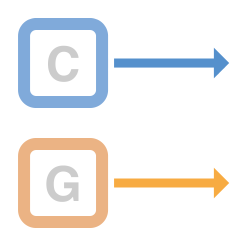

#  Metal Best Practices Guide - Metal 最佳实践指南

英文原文 https://developer.apple.com/library/archive/documentation/3DDrawing/Conceptual/MTLBestPracticesGuide/index.html#//apple_ref/doc/uid/TP40016642?language=objc

## Metal Best Practices - Metal 最佳实践

### Fundamental Concepts - 基础概念

> Metal provides the lowest-overhead access to the GPU, enabling you to maximize the graphics and compute potential of your app on iOS, macOS, and tvOS. Every millisecond and every bit is integral to a Metal app and the user experience–it’s your responsibility to make sure your Metal app performs as efficiently as possible by following the best practices described in this guide. Unless otherwise stated, these best practices apply to all platforms that support Metal.
>
> An efficient Metal app requires:
>
> - Low CPU overhead. Metal is designed to reduce or eliminate many CPU-side performance bottlenecks. Your app can benefit from this design only if you use the Metal API as recommended.
> - Optimal GPU performance. Metal allows you to create and submit commands to the GPU. To optimize GPU performance, your app should optimize the configuration and organization of these commands.
> - Continuous processor parallelism. Metal is designed to maximize CPU and GPU parallelism. Your app should keep these processors busy and working simultaneously.
> - Effective resource management. Metal provides simple yet powerful interfaces to your resource objects. Your app should manage these resources effectively to reduce memory consumption and increase access speed.

Metal 提供对 GPU 的最低开销访问，使你能够在 iOS ，macOS 和 tvOS 上最大化应用程序的图形和计算潜力。每毫秒和每个 bit 位都是 Metal 应用程序及用户体验的组成部分 - 你有责任通过遵循本指南中描述的最佳实践来确保 Metal 应用程序尽可能高效地运行。除非另有说明，这些最佳实践使用于支持 Metal 的所有平台。

高效的 Metal 应用程序需要：

-  低 CPU 开销。Metal 旨在减少或消除许多 CPU 端的性能瓶颈。只要按照推荐使用 Metal API ，你的应用程序才能从此设计中受益。
-  最佳 GPU 性能。Metal 允许创建并提交命令到 GPU 。要优化 GPU 性能，你的应用程序需要优化这些命令的配置和组织。
-  连续的处理器并行。Metal 旨在最大化 CPU 和 GPU 并行性。你的应用程序应该让这些处理器保持忙碌并让它们同时工作。
-  有效的资源管理。Metal 为资源对象提供了简单且强大的接口。你的应用程序应该有效地管理这些资源，以减少内存消耗并提高访问速度。

## Resource Management - 资源管理

### Persistent Objects - 持久对象

> Best Practice: Create persistent objects early and reuse them often.
>
> The Metal framework provides protocols to manage persistent objects throughout the lifetime of your app. These objects are expensive to create but are usually initialized once and reused often. You do not need to create these objects at the beginning of every render or compute loop.

最佳实践：尽早创建持久对象并经常重用它们

Metal 框架提供了协议管理应用程序整个生命周期内持久对象的。这些对象的创建成本很高，但通常会初始化一次并经常重复使用。你不需要在每个渲染或者计算循环的开头创建这些对象。

#### Initialize Your Device and Command Queue First - 首先初始化设备和命令队列

> Call the [MTLCreateSystemDefaultDevice](https://developer.apple.com/documentation/metal/1433401-mtlcreatesystemdefaultdevice) function at the start of your app to obtain the default system device. Next, call the [newCommandQueue](https://developer.apple.com/documentation/metal/mtldevice/1433388-newcommandqueue) or [newCommandQueueWithMaxCommandBufferCount:](https://developer.apple.com/documentation/metal/mtldevice/1433433-makecommandqueue) method to create a command queue for executing GPU instructions on that device.
>
> All apps should create only one [MTLDevice](https://developer.apple.com/documentation/metal/mtldevice) object per GPU and reuse it for all your Metal work on that GPU. Most apps should create only one [MTLCommandQueue](https://developer.apple.com/documentation/metal/mtlcommandqueue) object per GPU, though you may want more if each command queue represents different Metal work (for example, non-real-time compute processing and real-time graphics rendering).
>
> NOTE - Some macOS devices feature multiple GPUs. If you need to work with multiple GPUs, call the [MTLCopyAllDevices](https://developer.apple.com/documentation/metal/1433367-mtlcopyalldevices) function to obtain an array of available devices. Create and retain at least one command queue for each GPU you use.

在应用程序启动时调用 [MTLCreateSystemDefaultDevice](https://developer.apple.com/documentation/metal/1433401-mtlcreatesystemdefaultdevice) 函数获取默认系统设备。接下来，调用 [newCommandQueue](https://developer.apple.com/documentation/metal/mtldevice/1433388-newcommandqueue) 或 [newCommandQueueWithMaxCommandBufferCount:](https://developer.apple.com/documentation/metal/mtldevice/1433433-makecommandqueue) 方法创建用于在该设备上执行 GPU 指令的命令队列。

所有应用程序应该为每个 GPU 只创建一个 [MTLDevice](https://developer.apple.com/documentation/metal/mtldevice) 对象。大多数应用程序应该为每个 GPU 只创建一个 [MTLCommandQueue](https://developer.apple.com/documentation/metal/mtlcommandqueue) 对象，但如果每个命令队列代表不同的 Metal 工作（例如，非实时计算处理和实时图形渲染），你可能需要多个该对象。

注意 - 一些 macOS 设置具有多个 GPU 。如果你需要使用多个 GPU ，调用 [MTLCopyAllDevices](https://developer.apple.com/documentation/metal/1433367-mtlcopyalldevices) 函数获取可用设备的数组。为使用的每个 GPU 至少创建并保留一个命令队列。

#### Compile Your Functions and Build Your Library at Build Time - 在构建时编译函数并构建库

> For an overview of compiling your functions and building your library at build time, see the [Functions and Libraries](https://developer.apple.com/library/archive/documentation/3DDrawing/Conceptual/MTLBestPracticesGuide/FunctionsandLibraries.html#//apple_ref/doc/uid/TP40016642-CH24-SW1) best practices.
>
> At runtime, use the [MTLLibrary](https://developer.apple.com/documentation/metal/mtllibrary) and [MTLFunction](https://developer.apple.com/documentation/metal/mtlfunction) objects to access your library of graphics and compute functions. Avoid building your library at runtime or fetching functions during a render or compute loop.
>
> If you need to configure multiple render or compute pipelines, reuse [MTLFunction](https://developer.apple.com/documentation/metal/mtlfunction) objects whenever possible. You can release [MTLLibrary](https://developer.apple.com/documentation/metal/mtllibrary) and [MTLFunction](https://developer.apple.com/documentation/metal/mtlfunction) objects after building all render and compute pipelines that depend on them.

有关在构建时编译函数并构建库的概述，参见 [Functions and Libraries](https://developer.apple.com/library/archive/documentation/3DDrawing/Conceptual/MTLBestPracticesGuide/FunctionsandLibraries.html#//apple_ref/doc/uid/TP40016642-CH24-SW1) 最佳实践。

运行时，使用 [MTLLibrary](https://developer.apple.com/documentation/metal/mtllibrary) 和 [MTLFunction](https://developer.apple.com/documentation/metal/mtlfunction) 对象访问图形和计算函数库。避免在运行时构建库，避免在渲染或计算循环期间获取函数。

如果你需要配置多个渲染或计算管线，尽可能重用 [MTLFunction](https://developer.apple.com/documentation/metal/mtlfunction) 对象。在所有依赖它们的渲染和计算管线都构建好之后，你就可以释放 [MTLLibrary](https://developer.apple.com/documentation/metal/mtllibrary) 和 [MTLFunction](https://developer.apple.com/documentation/metal/mtlfunction) 对象了。

#### Build Your Pipelines Once and Reuse Them Often - 一次构建管线并经常重用它们

### Resource Options - 资源选项

### Triple Buffering - 三重缓冲

### Buffer Bindings - 缓冲区绑定

## Display Management - 显示管理

### Drawables - 可绘

### Native Screen Scale (iOS and tvOS) - 原生屏幕比例（ iOS 与 tvOS ）

### Frame Rate (iOS and tvOS) - 帧率（ iOS 与 tvOS ）

## Command Generation - 命令的生成

### Load and Store Actions - 加载和存储操作

### Render Command Encoders (iOS and tvOS) - 渲染命令编码器（ iOS 与 tvOS ）

### Command Buffers - 命令缓冲区

### Indirect Buffers - 间接缓冲

## Compilation - 汇编

### Functions and Libraries - 函数和库

### Pipelines - 管线

